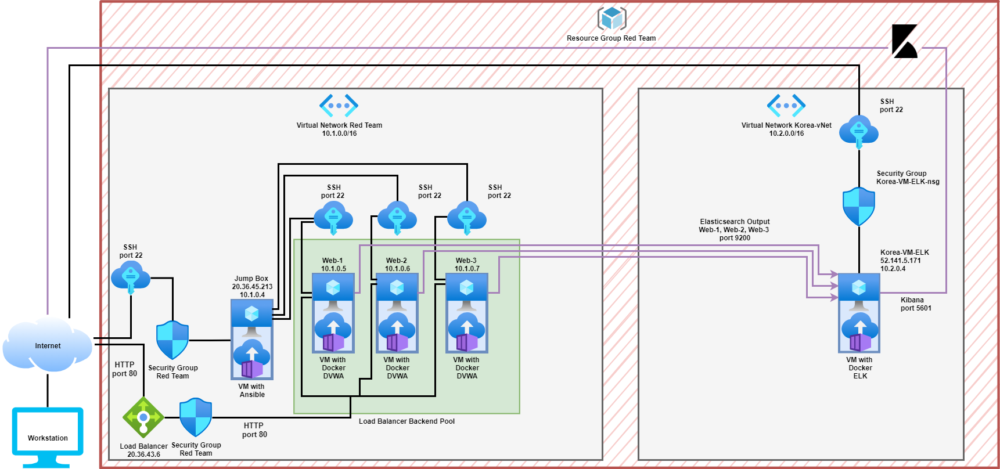
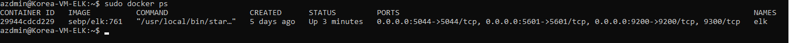

# Cybersecurity-Project-1
1st project for the UWA Cybersecurity Boot Camp

## Automated ELK Stack Deployment

The files in this repository were used to configure the network depicted below.



These files have been tested and used to generate a live ELK deployment on Azure. They can be used to either recreate the entire deployment pictured above. Alternatively, we can select portions of the yml and config file that may be used to install only certain pieces of it, such as Filebeat.

This is an example of a filebeat.yml file contents:
```bash
---
  - name: installing and launching filebeat
    hosts: webservers
    become: yes
    tasks:

    - name: download filebeat deb
      command: curl -L -O https://artifacts.elastic.co/downloads/beats/filebeat/filebeat-7.4.0-amd64.deb

    - name: install filebeat deb
      command: dpkg -i filebeat-7.4.0-amd64.deb

    - name: drop in filebeat.yml
      copy:
        src: /etc/ansible/files/filebeat-config.yml
        dest: /etc/filebeat/filebeat.yml

    - name: enable and configure system module
      command: filebeat modules enable system

    - name: setup filebeat
      command: filebeat setup

    - name: start filebeat service
      command: service filebeat start

    - name: enable service filebeat on boot
      systemd:
        name: filebeat
        enabled: yes
```
This document contains the following details:
- Description of the Topologu
- Access Policies
- ELK Configuration
  - Beats in Use
  - Machines Being Monitored
- How to Use the Ansible Build


### Description of the Topology

The main purpose of this network is to expose a load-balanced and monitored instance of DVWA, the D*mn Vulnerable Web Application.

Load balancing ensures that the application will be highly available, in addition to restricting traffic to the network.
- **Load Balancers:** A load balancer can add additional layers of security to web VMs with minimal changes, it does protect against DDos attacks by distributing traffic evenly against the nominated VMs in the backend pool but it would also be possible to add additional security measures here such as authentication of user access via user name and password before further access or the deployment of a web application firewall (WAP) to protect applications from emerging threats.
- **Jump Box:** An advantage of using a secure computer jump box is that all admins must first connect to it before launching any administrative task or use it as an origination point to connect to other servers or untrusted environments. Having restricted administrative access in this way can make a network more secure, it can also simplify the execution of tasks across a network.

Integrating an ELK server allows users to easily monitor the vulnerable VMs for changes to the data and system logs.
- **Filebeat:** Filebeat monitors the log files or specifically nominated locations and log events, it will forward them to Elasticsearch or Logstash depending on which is the most appropriate.
- **Metricbeat:**  Metricbeat records differing metrics and statistics and ships them to a specified output location such as Elasticsearch or Logstash.

The configuration details of each machine may be found below.

| Name     | Function | IP Address | Operating System |
|----------|----------|------------|------------------|
| Jump Box | Gateway  | 20.36.45.213 / 10.1.0.4   | Linux            |
| Web-1     |   Web Server       |       10.1.0.5     |         Linux         |
| Web-2     |    Web Server      |     10.1.0.6       |        Linux          |
| Web-3     |    Web Server      |      10.1.0.7      |        Linux          |
| ELK    |    ELK Server      |     52.141.5.171 / 10.2.0.4 |   Linux      |
| Load Balancer     | Load Balancer  | 20.36.43.5      |        Linux   |
| Workstation     |    Access Control | External IP      | Linux          |

### Access Policies

The machines on the internal network are not exposed to the public Internet. 

Only the ELK Server machine can accept connections from the Internet. Access to this machine is only allowed from the following IP addresses:
- A singular workstation public IP address (this address is pre-registered in the ELK machines security rules), it will be seeking a destination port of 5601.

Machines within the network can only be accessed by Jump Box Provisioner.
- Jump Box Provisioner IP: 10.1.0.4 on SSH port 22, this access is provided in the security rules covering the network. 

A summary of the access policies in place can be found in the table below.

| Name     | Publicly Accessible | Allowed IP Addresses |
|----------|---------------------|----------------------|
| Jump Box | No              | Workstation Public IP on SSH port 22    |
|    Web-1 | No              | 10.1.0.4 on SSH 22                 |
|       Web-2    |   No                   |10.1.0.4 on SSH port 22
|      Web-3    |   No                  |    10.1.0.4 on SSH port 22                  |
|  ELK        | Yes                    |       Workstation Public IP on Port 5601               |
|   Load Balancer       |         No            |     Workstation Public IP on HTTP port 80     |

### Elk Configuration

Ansible was used to automate configuration of the ELK machine. No configuration was performed manually, which is advantageous because this limits the time and human error concerns in successful deployment. Ansible allows us to deploy multiteir apps more easily, more quickly and with consistency. Ansible's ability for automatic configuration only requires us to list the tasks we need to be completed in the correct syntax and it will execute the tasks and make the nessary systems adjustments to reflect the requests from the playbook file.

The playbook implements the following tasks:

- We **name** this configeration and specifiy the **hosts** to which we want to deploy it, we also name a different **remote user** 
```bash
  - name: Configure Elk VM with Docker
    hosts: elk
    remote_user: azdmin
    become: true
    tasks:
```
- We use apt module in Linux to install **docker.io** and **python3-pip** and then **docker** which is a docker python pip module

      - name: Install docker.io
        apt:
          update_cache: yes
          force_apt_get: yes
          name: docker.io
          state: present
      - name: Install python3-pip
        apt:
          force_apt_get: yes
          name: python3-pip
          state: present
      - name: Install Docker module
        pip:
          name: docker
          state: present
- We use **sysctl** to increase memory to make sure that ELK can run effectively
      
      - name: Use more memory
        sysctl:
           name: vm.max_map_count
           value: "262144"
           state: present
           reload: yes

- We now launch the **docker container** and expose it on the list of **published ports** we have created

      - name: download and launch a docker elk container
        docker_container:
          name: elk
          image: sebp/elk:761
          state: started
          restart_policy: always
          published_ports:
            -  5601:5601
            -  9200:9200
            -  5044:5044

The following screenshot displays the result of running `docker ps` after successfully configuring the ELK instance.



### Target Machines & Beats
This ELK server is configured to monitor the following machines:
- Web-1 : 10.1.0.5
- Web-2 : 10.1.0.6
- Web-3 : 10.1.0.7

We have installed the following Beats on these machines:
- We successfully installed **Filebeat** and **Metricbeat** as part of our ELK stack, the relavant information from Web-1, Web-2, and Web-3 is transported to the ELK server.

These Beats allow us to collect the following information from each machine:
- **Filebeat:** collects log events such as SSH logins, Sudo commands, and syslogs. we can use this data to see who is accessing the system and how they are doing it as well as what they are doing in the system. 
- **Metricbeat:** collects metrics for the system, the host, and the containers. This includes metrics on the CPU, memory, processes, and network traffic to name a few. This helps us to see if the systems are executing unusual processes or monitior any unusual network traffic patterns. 

### Using the Playbook
In order to use the playbook, you will need to have an Ansible control node already configured. Assuming you have such a control node provisioned: 

SSH into the control node and follow the steps below:
- Copy the **elk_install.yml** file to **/etc/ansible/roles/elk_install.yml**
- Update the hosts file to include the attribute **[elk]** underneath the **[webservers]** and their IPs and then include the IP of the Korean ELK server directly below [elk]. In the .yml file to be installed it should nominate the goup of machines that the file will be installed on, it will do this in the first section of the .yml file under the section for **hosts:**. For examle the **elk_install.yml** will have **hosts: elk** nominated, for **filebeat** or **metricbeat** it would have **hosts: webservers** nominated. Once the ansible **hosts** file is updated it should look like this: 
```bash 
# /etc/ansible/hosts
[webservers]
10.1.0.5 ansible_python_interpreter=usr/bin/python3
10.1.0.6 ansible_python_interpreter=usr/bin/python3
10.1.0.7 ansible_python_interpreter=usr/bin/python3

[elk]
10.2.0.4 ansible_python_interpreter=usr/bin/python3
```

- Run the playbook by using the command 
```bash
ansible-playbook /etc/ansible/roles/elk_install.yml
```
- Then navigate in your browser using your elk server public IP to **http://[your elkserver]:5601/app/kibana** to check that the installation worked as expected, in our case we will use **http://52.141.5.171:5601/app/kibana**. If it is working correctly we should see the following;


_TODO: Answer the following questions to fill in the blanks:_
- _Which file is the playbook? Where do you copy it?_
- _Which file do you update to make Ansible run the playbook on a specific machine? How do I specify which machine to install the ELK server on versus which to install Filebeat on?_
- _Which URL do you navigate to in order to check that the ELK server is running?

_As a **Bonus**, provide the specific commands the user will need to run to download the playbook, update the files, etc._
